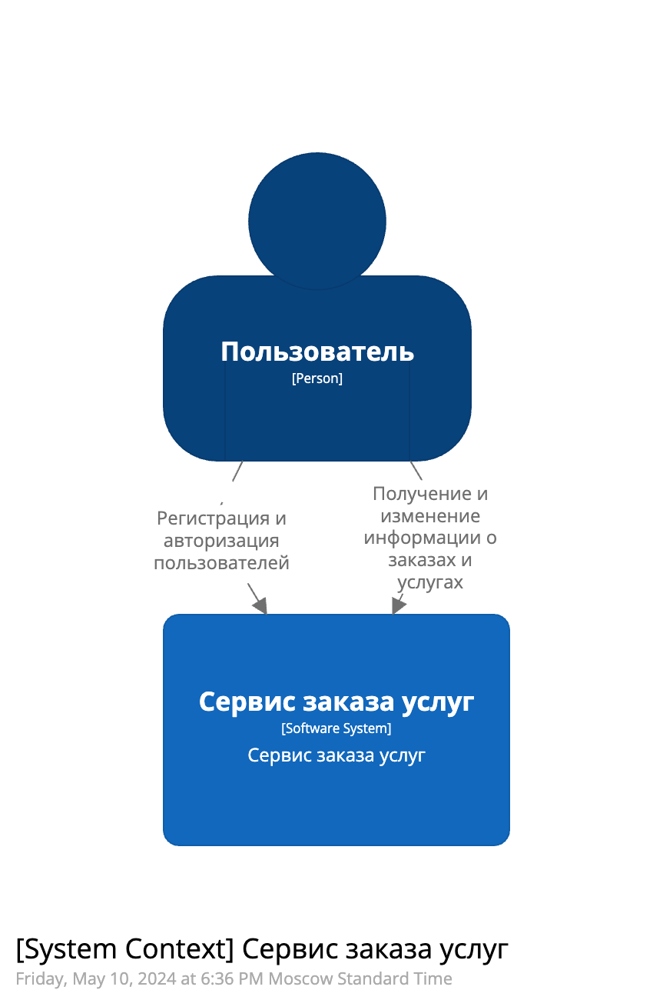
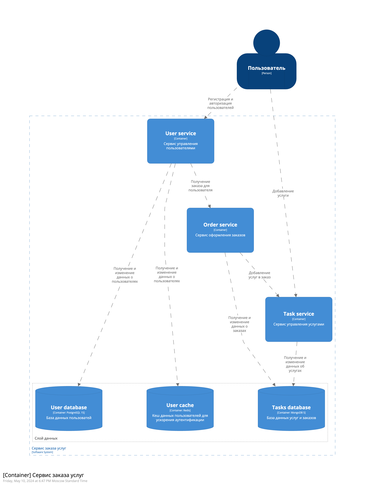
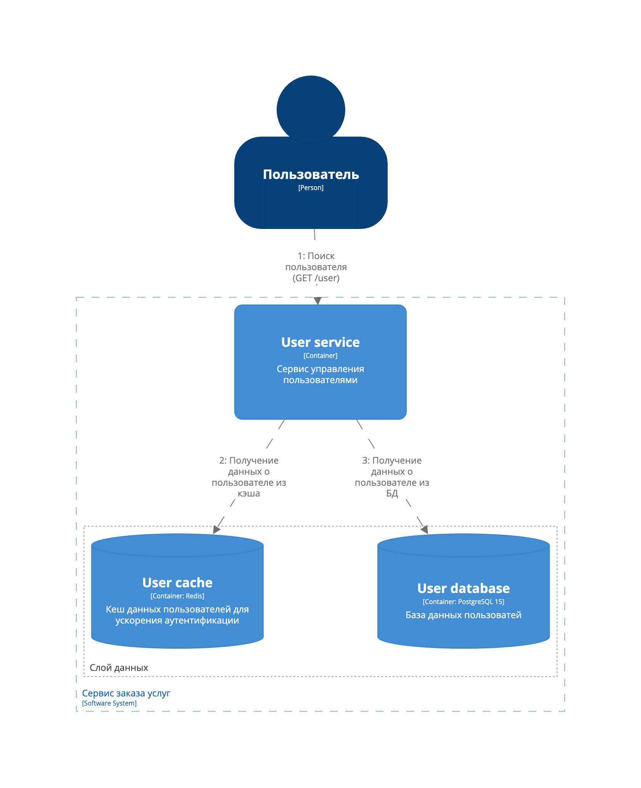
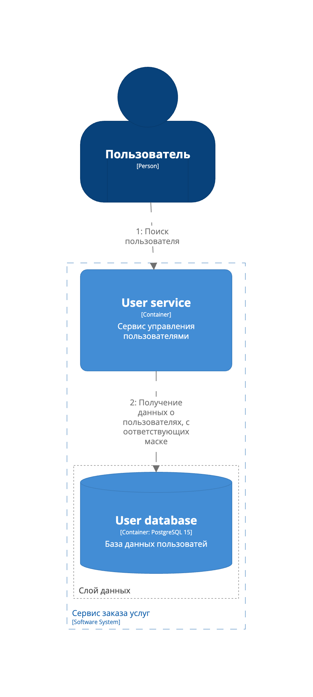
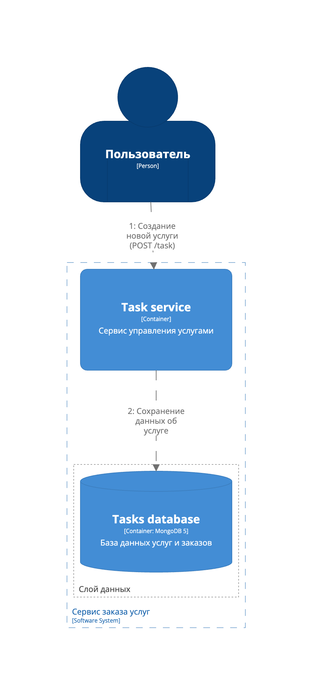
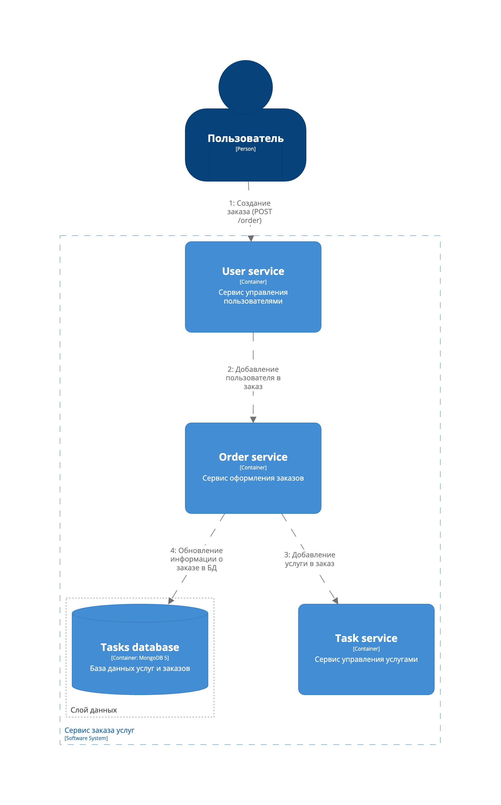
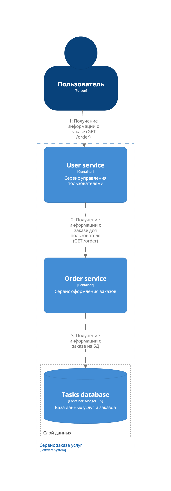

# Лабораторная работа 1
## Проектирование программной системы (Architecture As A Code)

**Вариант 4 - Сайт заказа услуг**

1. Создать файлы с описанием «архитектуры» согласно варианту задания в Structurizr Lite
2. Требования к диаграммам:
* Должна быть контекстная диаграмма
* Должна быть диаграмма контейнеров
* Должна быть диаграмма развертывания
* Должно быть несколько динамических диаграмм

Приложение должно содержать следующие данные:
* Пользователь
* Услуга
* Заказ

Реализовать API:
* Создание нового пользователя
* Поиск пользователя по логину
* Поиск пользователя по маске имя и фамилии
* Создание услуги
* Получение списка услуг
* Добавление услуг в заказ
* Получение заказа для пользователя

### Контекстная диаграмма

### Диаграмма контейнеров

### Динамические диаграммы
#### 1. Создание нового пользователя

#### 2. Поиск пользователя по логину

#### 3. Поиск пользователя по маске имени и фамилии

#### 4. Создание услуги

#### 5. Получение списка услуг

#### 6. Добавление услуг в заказ

#### 7. Получение заказа для пользователя

